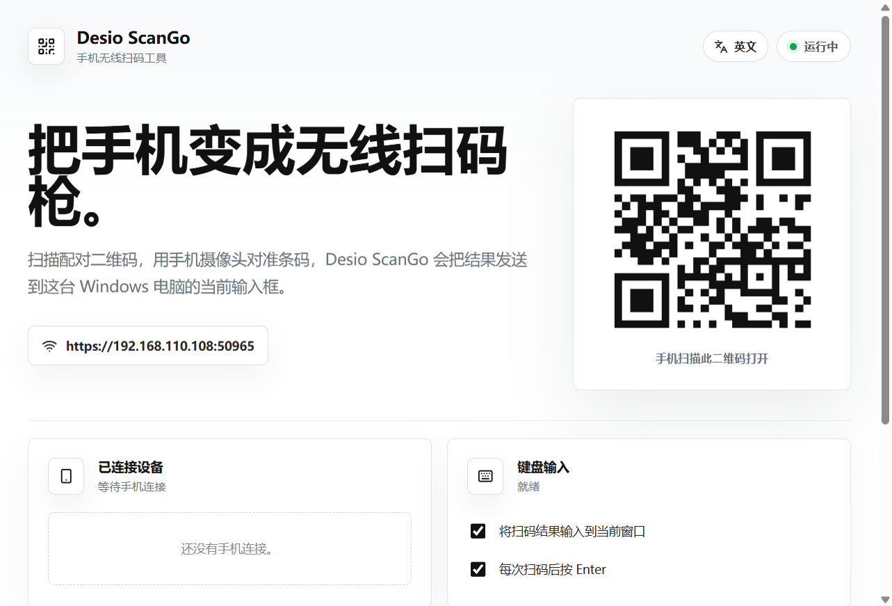
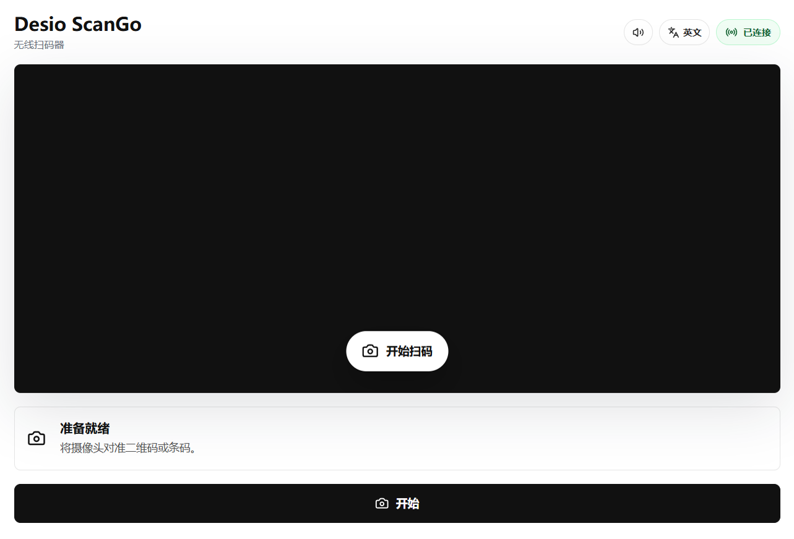

# Desio ScanGo

把手机变成电脑的无线扫码枪。

手机浏览器打开一个网页，用摄像头扫条码，结果实时回传到电脑，并可选自动键入到当前光标所在的输入框。手机不需要安装任何 App，扫一下桌面端的配对二维码即可。





---

## 目录

- [它能做什么](#它能做什么)
- [工作原理](#工作原理)
- [快速开始](#快速开始)
- [iPhone 必读：装一次证书](#iphone-必读装一次证书)
- [Android 说明](#android-说明)
- [常见问题](#常见问题)
- [分发给其他人](#分发给其他人)
- [项目结构](#项目结构)
- [开发](#开发)
- [安全说明](#安全说明)
- [许可证](#许可证)

---

## 它能做什么

- 手机扫码，结果毫秒级回传电脑
- 支持 EAN-13、EAN-8、Code 128、Code 39、QR 码等常见一维码与二维码（基于 ZXing）
- 扫码结果自动键入到当前焦点窗口，可配置是否追加回车、前后缀
- 桌面端实时显示已连接设备与扫码历史
- 手机端扫码成功有提示音与震动反馈，提示音可开关
- 界面全中文（应用菜单同为中文），内置中英文切换
- 支持多手机同时连接，每条记录标注来源设备

## 工作原理

```text
手机摄像头 → 浏览器解码(ZXing) → WebSocket 回传 → 桌面端 → 键盘输入 / 历史列表
```

1. 桌面端在本机启动一个局域网服务（HTTPS + WebSocket），监听 `0.0.0.0`
2. 桌面端把服务地址生成二维码显示在窗口里
3. 手机扫码打开网页，浏览器申请摄像头权限并开始解码
4. 每扫到一条，通过 WebSocket 发回桌面端
5. 桌面端按设置决定：是否键入、是否追加回车，并写入历史列表

服务端口是**随机分配**的（每次启动都可能不同），所以不要保存旧链接，每次用桌面端上显示的那个二维码。

## 快速开始

### 环境要求

| 项目 | 要求 |
| --- | --- |
| 系统 | Windows（键盘输入模拟基于 Windows） |
| Node.js | 20 或更高 |
| 网络 | 手机与电脑在**同一个 WiFi / 局域网** |
| 证书 | 需要 openssl（生成 HTTPS 证书用） |

### 安装并启动

```bash
npm install
npm run dev:cert   # 生成 HTTPS 证书（换 WiFi 或 IP 变化后要重跑）
npm run dev
```

桌面端窗口会自动打开，右上角显示「运行中」，右侧是配对二维码。

启动两个服务：

| 服务 | 默认地址 | 说明 |
| --- | --- | --- |
| 手机端页面 | `https://<本机IP>:5173` | Vite 开发服务器 |
| 桌面端扫码服务 | `https://<本机IP>:<随机端口>` | 二维码里指向的就是它 |

### 用手机连上

1. iPhone 先按下一节装一次证书
2. 用手机相机扫桌面端窗口里的二维码
3. 网页打开后点「开始扫码」，允许摄像头权限
4. 对着条码扫，电脑上就能看到结果

## iPhone 必读：装一次证书

iOS Safari 有一条硬性规定：**只有 `https://` 或 `localhost` 下的页面才允许调用摄像头**。局域网 IP（`http://192.168.x.x`）属于非安全来源，`navigator.mediaDevices` 直接是 undefined，扫码功能根本不会启动。

Android Chrome 可以用 flag 临时放行，iOS 没有这个开关，所以只能走 HTTPS + 自签证书。这也是为什么上面要先跑 `npm run dev:cert`。

证书只需安装一次，之后长期有效（有效期 825 天，这是 iOS 对服务器证书的硬性上限）。

### 安装步骤

**1. 下载证书**

用 iPhone 的 Safari 访问（端口看桌面端二维码上显示的那个，每次随机）：

```text
https://192.168.x.x:<端口>/ca.pem
```

Safari 会提示「无法验证服务器身份」，点「详细信息」→「访问此网站」。

**2. 安装描述文件**

弹出安装提示后点「允许」，按引导完成安装。

**3. 手动开启信任（最容易漏的一步）**

```text
设置 → 通用 → VPN与设备管理 → 安装描述文件
设置 → 通用 → 关于本机 → 证书信任设置 → 打开 "Desio ScanGo Dev CA" 开关
```

**只有第 3 步做完，Safari 才会真正信任这张证书。** 装了描述文件但没开信任开关，访问时依然会被拒绝。

### IP 变了怎么办

证书里写死了签发时的局域网 IP。换 WiFi、路由器重新分配地址之后，需要重新签发：

```bash
npm run dev:cert
```

然后重启 dev，iPhone 上重新装一次新证书。

## Android 说明

Android Chrome 有两个选择：

- **推荐**：跟 iOS 一样走 HTTPS，访问 `https://<本机IP>:<端口>/ca.pem` 下载证书安装即可
- **临时方案**：地址栏打开 `chrome://flags/#unsafely-treat-insecure-origin-as-secure`，填入 `http://<本机IP>:5173`，重启浏览器

Android 上扫码成功会同时震动并播放提示音；iPhone 不支持震动接口，只有提示音。

## 常见问题

**手机上打不开二维码里的地址**

先确认手机和电脑在同一个 WiFi，且 IP 前三位一致。然后确认电脑防火墙没有拦掉 Node.js / Electron（Windows 公用网络下默认可能拦截）。

**页面打开了，但点开始扫码没反应**

十有八九是没走 HTTPS，或者证书没开信任。页面上会直接提示「当前不是安全来源，浏览器已禁用摄像头」，按上面的步骤装证书即可。

**扫码结果打到了聊天框 / 别的地方**

键盘输入会打到**当时有焦点的窗口**。正式用法是先把光标点到目标输入框（Excel 单元格、ERP 搜索框等），再用手机扫。不想自动输入的话，在桌面端取消勾选「将扫码结果输入到当前窗口」，记录仍会保留在列表里。

**扫码服务端口每次都不一样**

这是设计如此（端口随机分配）。重启后请用桌面端上最新的二维码，别存旧链接。

**没有 openssl 怎么办**

`npm run dev:cert` 依赖 openssl。Windows 上装 Git for Windows 后会自带（在 `Git\mingw64\bin\openssl.exe`）。没有的话整个项目会自动回落到 HTTP，功能不受影响，只是 iPhone 无法调用摄像头。

## 分发给其他人

| 对象 | 怎么用 | 状态 |
| --- | --- | --- |
| 扫码的手机 | 无需安装任何 App，扫桌面端二维码即用 | 完全可用 |
| 想在自己电脑上跑的人 | 按[部署指南](docs/deployment.md)在**本机**装依赖并生成证书 | 推荐方式 |
| 想要双击安装包的人 | `npm run package` 生成 exe | 有限制，见下 |

### 为什么推荐源码运行而不是发安装包

HTTPS 证书里绑定的是签发时的局域网 IP。每台电脑的 IP 不同，所以证书必须由使用者**在自己机器上现场生成**，别人代劳生成好再拷贝过去是无效的。

源码运行方式下，`npm run dev:cert` 会按当前机器的 IP 签发证书，iPhone 完全可用。完整步骤见 [docs/deployment.md](docs/deployment.md)，照做约十分钟。

> **已知限制**：`npm run package` 打出来的安装包目前不带证书，会以 HTTP 运行，因此**打包版在 iPhone 上无法调用摄像头**。要让它也支持 iOS，需要程序在首次启动时按当前局域网 IP 自动生成证书（尚未实现）。在那之前，请把部署指南发给使用者。

## 项目结构

```text
desktop/
  electron/    Electron 主进程与 preload（应用菜单、IPC、窗口）
  input/       Windows 键盘输入适配器
  server/      局域网 HTTPS/WebSocket 服务、二维码生成
  src/         桌面端渲染层（React）
mobile/
  src/         手机端扫码网页（React + Vite + ZXing）
scripts/
  generate-dev-cert.mjs   自签 CA 与服务器证书生成脚本
docs/
  需求说明、界面截图
```

## 开发

```bash
npm run dev        # 启动开发服务（手机端 5173 + 桌面端）
npm run dev:cert   # 生成 / 重新生成 HTTPS 证书
npm run lint       # 代码检查
npm run build      # 构建前端产物
npm run package    # 打包 Windows 安装包，输出到 release/
```

代码风格与提交约定见 [CONTRIBUTING.md](CONTRIBUTING.md)。

## 安全说明

Desio ScanGo 面向**可信的局域网**使用。当前版本只要设备能打开配对链接就可以发送扫码结果，没有做配对令牌或设备审批。在公共网络、公司共享网络等不可信环境中使用前，建议先加上 pairing token 与设备白名单。

证书仅用于本地开发调试，请勿用于生产环境对外服务。

## 许可证

[MIT](LICENSE)
